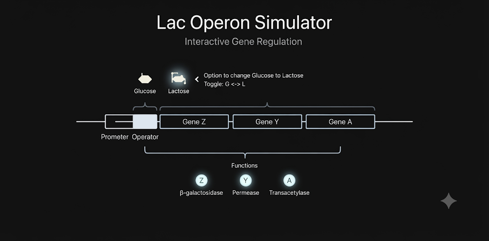

  

# 🧬 Operon-Kodex

**Interactive Lac Operon Simulator**

---

### 📖 Overview
**Operon-Kodex** is an open-source educational tool that visualizes bacterial gene regulation. It provides an intuitive, interactive environment to explore the molecular dynamics of the *Lac* operon.

### ✨ Features
* **Dynamic Visualization**: Scientifically accurate HTML5 Canvas animations of the *Lac* operon.
* **Regulatory Control**: Interactive simulation of repressor activity, operator binding, and allolactose induction.
* **Gene Expression**: Visualize the transcription and translation of *lacZ*, *lacY*, and *lacA*.
* **Metabolic Modeling**: Real-time Lactose ON/OFF metabolism states.
* **Accessible Interface**: Browser-based, responsive design requiring no external frameworks.

---

### 📜 License
GPL-3.0

### 👨‍🏫 Author
**Draven Ashcroft** | DIPS Chain of Institutions, Tanda

---

### 🙏 Acknowledgements
Developed with technical support from OpenAI, Anthropic, and Google. Inspired by NCERT Biology and modern scientific visualization standards.
