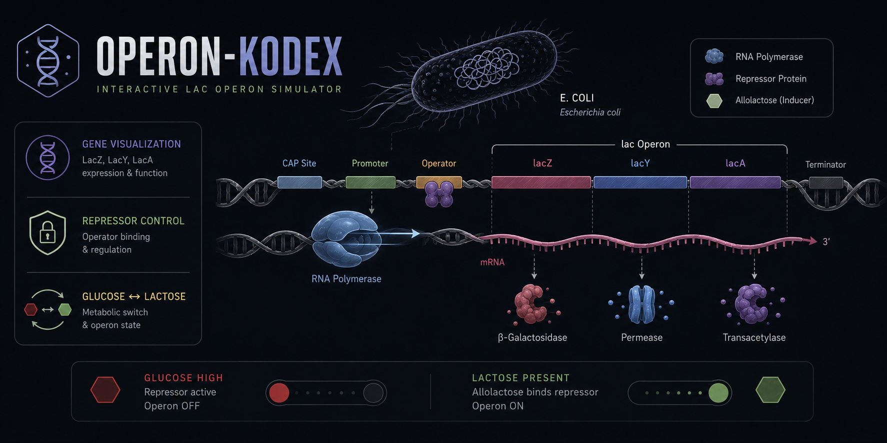

  

# 🧬 Operon-Kodex

Interactive Lac operon simulator visualizing bacterial gene regulation and inducible gene expression.

---

## ✨ Features

* **Interactive Regulation:** Explore repressor binding, operator control, and allolactose induction.
* **Gene Visualization:** Scientifically accurate visualization of *lacZ*, *lacY*, and *lacA* expression.
* **Metabolic States:** Simulate lactose-dependent ON/OFF operon activity.
* **Responsive Design:** Optimized for desktop and mobile devices.

---

## 🚀 Built & Hosting

* **Repository:** GitHub
* **Hosting:** GitHub Pages

---

## 🛠️ Credits & Acknowledgments

* **Claude Sonnet:** Debugging, code generation & architecture.
* **Replit:** Code improvisation & rapid prototyping.
* **OpenAI:** Scientific debugging, testing & logic optimization.

---

## 👤 Author

* **Draven Ashcroft**
  * M.Sc. Ag. Entomology, ASRB NET
  * DIPS Chain of Institutions

---

## 📜 License

GPL-3.0
